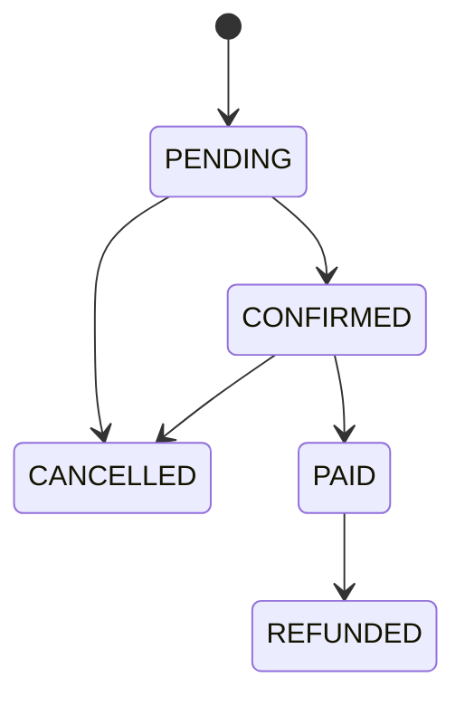

# Architecture

## Goals

A production-oriented point-of-sale backend focused on reliable inventory and checkout workflows.

## Layers

- `internal/domain`: entities, invariants, and domain services; no infrastructure dependencies.
- `internal/application`: use cases and ports.
- `internal/infrastructure`: PostgreSQL, provider, and other adapters.
- `internal/interfaces`: HTTP handlers, middleware, and API transport.
- `cmd/api`: process wiring and startup.

Dependencies point inward. PostgreSQL is the primary datastore.

## Scope

Authentication and RBAC; products and categories; inventory and stock movements; customers; orders and order items; checkout and payment integration; cancellation, refunds, and audit logs.

## Runtime

The HTTP process exposes `GET /healthz` and PostgreSQL-backed `GET /readyz`. Transactional checkout and inventory change use cases are implemented; business endpoints and authentication middleware follow in feature branches.

## Order lifecycle

