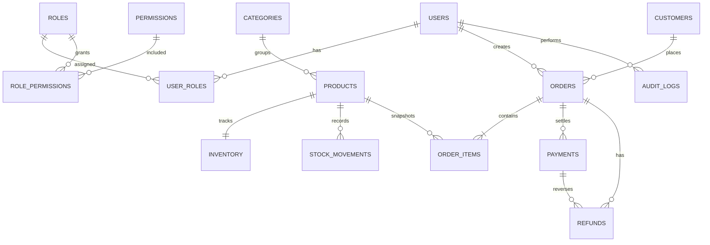

# Entity relationship diagram

The diagram shows the implemented core relationships. Exact columns and constraints are defined by the ordered migrations.

```mermaid
erDiagram
  USERS ||--o{ USER_ROLES : has
  ROLES ||--o{ USER_ROLES : assigned
  ROLES ||--o{ ROLE_PERMISSIONS : grants
  PERMISSIONS ||--o{ ROLE_PERMISSIONS : included
  CATEGORIES ||--o{ PRODUCTS : groups
  PRODUCTS ||--|| INVENTORY : tracks
  PRODUCTS ||--o{ STOCK_MOVEMENTS : records
  CUSTOMERS ||--o{ ORDERS : places
  USERS ||--o{ ORDERS : creates
  ORDERS ||--|{ ORDER_ITEMS : contains
  PRODUCTS ||--o{ ORDER_ITEMS : snapshots
  ORDERS ||--o{ PAYMENTS : settles
  ORDERS ||--o{ REFUNDS : has
  PAYMENTS ||--o{ REFUNDS : reverses
  USERS ||--o{ AUDIT_LOGS : performs
```
