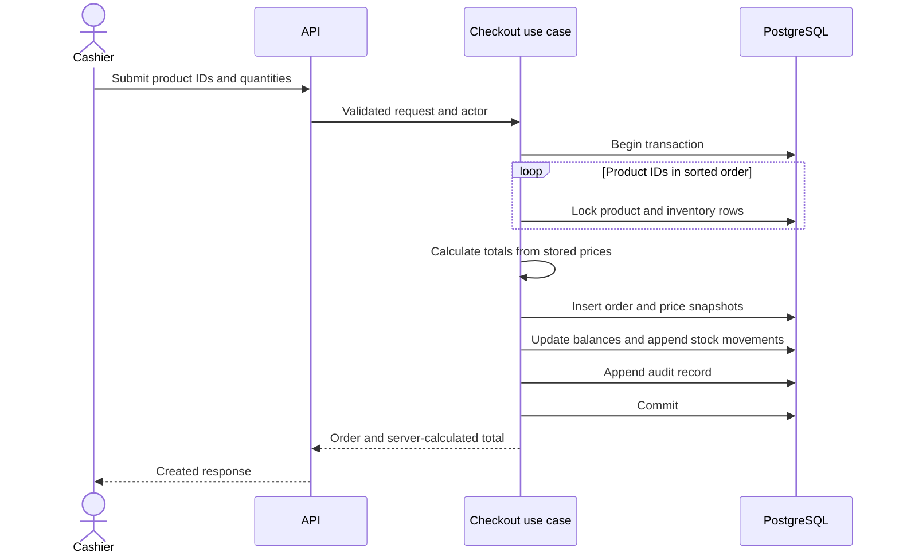

# Checkout sequence

The HTTP order route will call the implemented checkout use case once authentication and RBAC middleware are in place.

```mermaid
sequenceDiagram
  actor Cashier
  participant API
  participant Checkout as Checkout use case
  participant DB as PostgreSQL
  Cashier->>API: Submit product IDs and quantities
  API->>Checkout: Validated request and actor
  Checkout->>DB: Begin transaction
  loop Product IDs in sorted order
    Checkout->>DB: Lock product and inventory rows
  end
  Checkout->>Checkout: Calculate totals from stored prices
  Checkout->>DB: Insert order and price snapshots
  Checkout->>DB: Update balances and append stock movements
  Checkout->>DB: Append audit record
  Checkout->>DB: Commit
  Checkout-->>API: Order and server-calculated total
  API-->>Cashier: Created response
```
