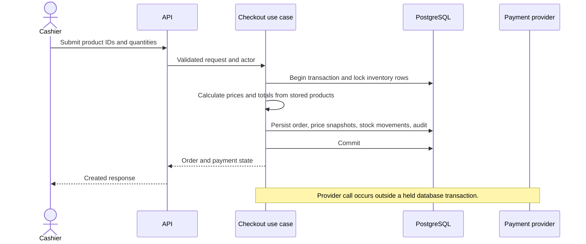

# Checkout sequence (planned)

```mermaid
sequenceDiagram
  actor Cashier
  participant API
  participant Checkout as Checkout use case
  participant DB as PostgreSQL
  participant Provider as Payment provider
  Cashier->>API: Submit product IDs and quantities
  API->>Checkout: Validated request and actor
  Checkout->>DB: Begin transaction and lock inventory rows
  Checkout->>Checkout: Calculate prices and totals from stored products
  Checkout->>DB: Persist order, price snapshots, stock movements, audit
  Checkout->>DB: Commit
  Checkout-->>API: Order and payment state
  API-->>Cashier: Created response
  Note over Checkout,Provider: Provider call occurs outside a held database transaction.
```
